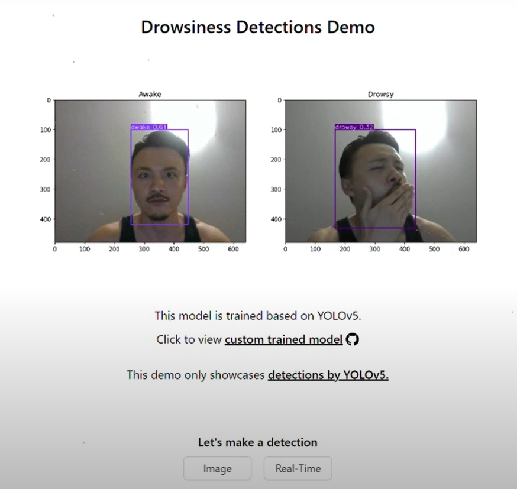

## Drowsiness Detection - YOLOv5s

### DEMO

- Check out my demo video showcasing the Drowsiness Detection application in action:
  - [Drowsiness Detections](https://www.youtube.com/watch?v=KFHNxGSGBc8&feature=youtu.be)

### Overview

- Drowsiness Detection is an application that utilizes the YOLOv5 and custom-trained image data to detect whether a person appears drowsy or awake.
- It can be further enhanced and adapted for various use cases in different domains.

### Features

- Utilizes YOLOv5s as the benchmark model for accurate and efficient detection.
- Custom trained image data ensures improved performance in detecting drowsiness.
- Provides real-time monitoring of individuals to determine their level of alertness.
- Can be integrated into various applications, such as driver monitoring systems or workplace safety solutions.
